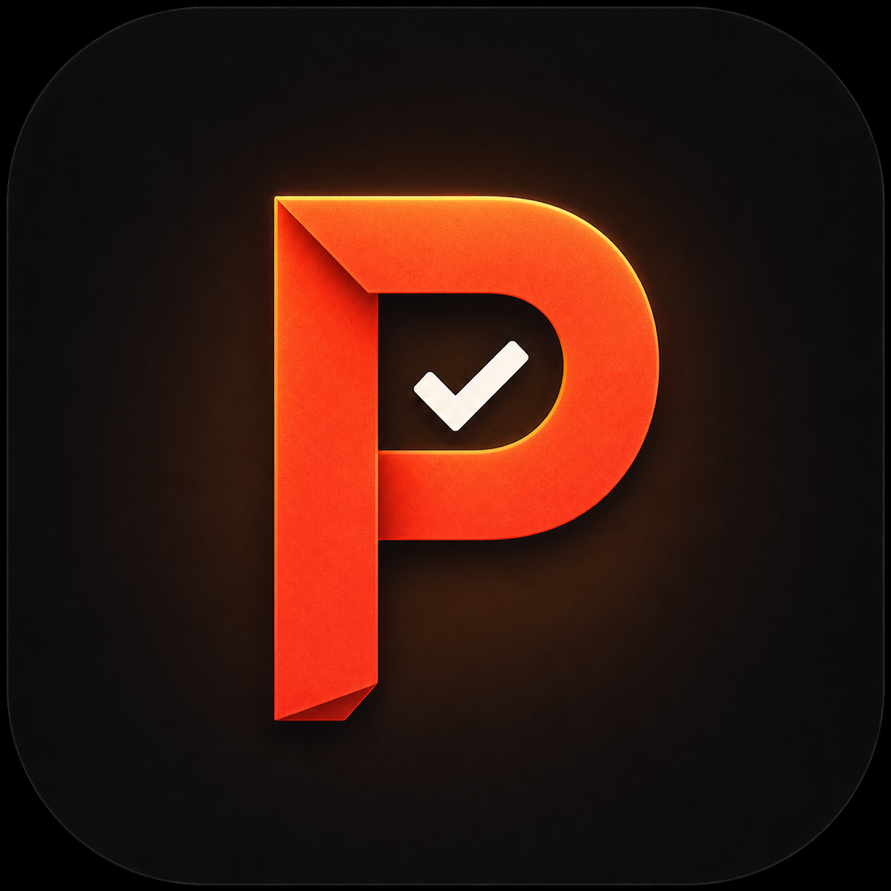

<p align="center">
  
</p>

<h1 align="center">ProofMend</h1>

<p align="center">
  <strong>Private, on-device English grammar checking for macOS.</strong>
</p>

<p align="center">
  
  
  
  
</p>

## About ProofMend

ProofMend is a privacy-first grammar and spell checker built specifically for macOS. It supports US, UK, Australian, and Canadian English.

LanguageTool runs locally on your Mac, so your writing is not sent to a cloud service. ProofMend requires no account, browser extension, or subscription.

Unlike writing assistants that interrupt your workflow with sidebars and constant pop-ups, ProofMend stays quietly in the menu bar. Use native inline corrections where macOS supports them, or select text in any app and press a global keyboard shortcut when you want help.

## Features

- English-only grammar and spelling correction
- US, UK, Australian, and Canadian English conventions
- Local processing powered by LanguageTool
- System-wide inline corrections in supported macOS applications
- Global shortcut for correcting selected text in other applications
- Lightweight macOS menu-bar interface
- Configurable correction strength and keyboard shortcut
- Automatic launch-at-login option
- No account, subscription, or cloud processing

## Privacy

ProofMend starts a local LanguageTool server bound to `127.0.0.1`. Correction requests remain on your Mac and are not sent to ProofMend, CRIT Studio, or an external cloud service.

The Accessibility permission is used only to read and replace text selected in other applications.

## Requirements

- macOS 14 Sonoma or later
- Java 17 or later
- Approximately 250 MB of storage for LanguageTool

Install Eclipse Temurin Java 17 with Homebrew:

```bash
brew install --cask temurin@17
```

Confirm the installation:

```bash
java -version
```

## Installation

1. Download the latest ProofMend DMG from the GitHub **Releases** section.
2. Open the DMG.
3. Drag **ProofMend** into the **Applications** folder.
4. Launch ProofMend from Applications.
5. Open **ProofMend Settings → Engine**.
6. Download LanguageTool and start the grammar engine.

Development builds are ad-hoc signed. For public distribution, the application should be signed with an Apple Developer ID and notarized.

## First-time setup

### 1. Grant Accessibility permission

Open:

**System Settings → Privacy & Security → Accessibility**

Enable ProofMend. This allows the global shortcut to read and replace selected text.

### 2. Enable inline corrections

Open:

**System Settings → Keyboard → Text Input → Edit → Spelling**

Select **ProofMend** as the spelling checker.

### 3. Correct selected text

Select text in an application and press the configured shortcut. The default shortcut is:

```text
Control + Option + G
```

## Supported applications

Native inline corrections work in applications that use the standard macOS text system, including:

- Mail
- Notes
- TextEdit
- Pages
- Keynote
- Finder rename fields

Applications with custom text editors—such as Chrome, Visual Studio Code, and Slack—may not use the macOS system checker. Use ProofMend’s global shortcut in those applications.

## Building from source

1. Clone the repository:

```bash
git clone https://github.com/YOUR-USERNAME/ProofMend.git
cd ProofMend
```

2. Open `ProofMend.xcodeproj` in Xcode 16 or later.
3. Select the **ProofMend** scheme.
4. Build and run with `Command + R`.

The project contains two targets:

| Target | Purpose |
| --- | --- |
| `ProofMend` | Menu-bar application, settings, engine management, and global correction shortcut |
| `ProofMendSpellChecker` | Background macOS spelling service used for inline corrections |

## How it works

```text
ProofMend menu-bar app
├── Starts LanguageTool locally on 127.0.0.1
├── Reads selected text through the macOS Accessibility API
├── Sends text to the local LanguageTool server
├── Applies corrections and replaces the selection
└── Installs the ProofMendSpellChecker service
    └── Provides inline spelling and grammar results to macOS apps
```

## Technology

- Swift
- SwiftUI
- AppKit
- macOS Accessibility API
- `NSSpellServer`
- LanguageTool

## License

The ProofMend source code is available under the MIT License.

```text
Copyright (c) 2026 Kamalanarayanan, CRIT Studio
```

The **ProofMend** name, logo, app icon, and other brand assets are copyright © 2026 Kamalanarayanan, CRIT Studio. All rights reserved. They are not included in the MIT grant for the source code.

LanguageTool is a separate project distributed under the GNU Lesser General Public License, version 2.1 or later. Its license and third-party notices remain applicable.

## Creator

Created by **Kamalanarayanan** at **CRIT Studio**.

Email: [kamalgeek92@gmail.com](mailto:kamalgeek92@gmail.com)

## Contributing

Bug reports and thoughtful contributions are welcome. Please open a GitHub issue before starting a substantial change so the proposed approach can be discussed.
